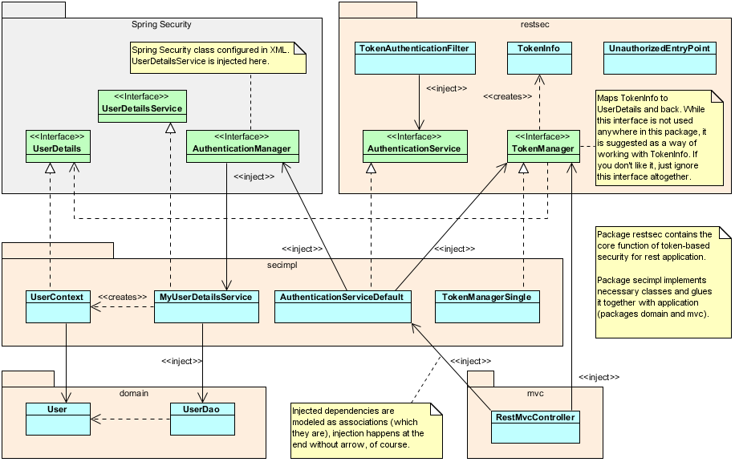

restful-spring-security
=======================
Small test RESTful app with token based security. Its main reason is documentation for myself. :-) This demo features:

* `@RestController`s in separate MVC application context.
* Main application context with `@Service`s and Spring Security (also parent for MVC context).
* Following things are part of the security solution and must be configured:
	* Security filter `TokenAuthenticationFilter` takes care of HTTP and uses `AuthenticationService`
	  that takes care of the "security business".
	* `AuthenticationService` that performs the main "security business". It uses Spring's `authenticationManager`
	  to authenticate users and `TokenManager` implementation that offers variability in policy how tokens should work.
	* Solution is separated  into two packages. Package `restsec` contains core if it and may work as a drop-in solution
	  (adjust stdout debugs, etc). Package `secimpl` is example how `restsec` is glued with the actual application -
	  here represented by `domain` and `mvc` packages.
* Gradle build based on Spring Boot - just run Gradle task `bootRun` and enjoy
(e.g. run `test.sh` when it runs).

**Demo does not feature any front-end JavaScript. Sorry.** You have to use browser, preferably with something
like http://restclient.net/ - or even better with `curl` command.

Companion blog post: http://virgo47.wordpress.com/2014/07/27/restful-spring-security-with-authentication-token/

## Diagram!

UML class diagram, yeah! That's what I missed most when I read Spring Security 3.1 book, actually. So hopefully
you'll like it. If it does not make sense, let me know what's wrong with it. (BTW, check aforementioned blog post
for sequence diagrams of login/logout/token check, etc.)

## Sources, inspiration

Demo is inspired by internal needs, took a lot of information from Google and StackOverflow - which lead me to:
https://github.com/philipsorst/angular-rest-springsecurity/
That project has additional AngularJS and JPA, while I wanted to focus on Spring Security +
MVC's @RestController only + practice Gradle a bit.

## Notes

* I recently upgraded the demo to Spring Boot 1.3 to avoid the need of running application server.
  This brought Spring Security 4.x as well, but I didn't convert the XML configuration for Spring
  Security completely yet. Currently 3 "bash" tests fail, I have to look at it. (/ test is just
  a regression as we don't have any page there now, two other failures indicate that security
  annotations are ignored.)
* If `context:component-scan` is used in Spring configs, be sure to specify disjoint values for `base-package`.
  You don't want your Controllers to be picked by main appcontext or the other way around. Separate JARs don't solve
  this because the resolution (initialization) is performed during runtime.
* If login is repeated it is important to invalidate older tokens for the same user. Try http://localhost:8080/respsec/secure/mytokens with
  X-Username: admin; X-Password: admin - it should display just a single token. Other policies can be chosen
  implementing different `TokenManager`, you can store more tokens for a user, let him manage those, etc. In such cases tokens
  may be bound to IP address depending on the needs.

## TODO

* How to invalidate tokens after some time? How to refresh them seamlessly? Should client expect renewed token in any response?
* How to add more authorization mechanisms? Can we SSO to Windows Domain? Can we integrate something like [Waffle](https://github.com/dblock/waffle)?
* CSRF (default on in Spring Security 4) is disabled - does it even make sense in our scenario?

## Examples

Assuming you started the boot application (`gradle bootRun`) then the app runs on port
8080 and root context - and you can try following `curl` commands:

* Start with login. Don't omit the last / or it will not be intercepted by Spring Security. POST must be used:

    `curl -i -X POST -H "X-Username: admin" -H "X-Password: admin" http://localhost:8080/respsec/`

    Or to put the token into handy variable:

    ``X_AUTH_TOKEN=`curl -i -X POST -H "X-Username: admin" -H "X-Password: admin" http://localhost:8080/respsec/ | grep "X-Auth-Token" | cut -d' ' -f2` && echo $X_AUTH_TOKEN``

* Previous command returns X-Auth-Token, you have to use it in the following example (we can switch to GET now + we're adding new line after the output):

    `curl -i -w '\n' -H "X-Auth-Token: $X_AUTH_TOKEN" http://localhost:8080/respsec/secure/allusers`

* Try to access the same without token or with an invalid one - should result in 401:

    `curl -i -w '\n' -H "X-Auth-Token: invalid" http://localhost:8080/respsec/secure/allusers`

    `curl -i -w '\n' http://localhost:8080/respsec/secure/allusers`

* After you try other API URLs, you can go for logout. It must be POST, GET will fall through the filter to the controller (if mapped):

    `curl -i -w '\n' -H "X-Auth-Token: $X_AUTH_TOKEN" http://localhost:8080/respsec/logout`

* If you repeat the logout request, it will return 401, because the token is not valid anymore.
* You can combine valid token and login, because login is internally performed after token validation. However, from the next request you have to use newly returned token.
* If you combine login with invalid token, login will not be performed regardless of credentials provided.
* To find out what Spring Security thinks you are, try debug request:

	`curl -i -w '\n' http://localhost:8080/respsec/test` (anonymous)

	`curl -i -w '\n' -H "X-Auth-Token: $X_AUTH_TOKEN" http://localhost:8080/respsec/test` (authenticated user)

## Test

See `test.sh` for simple bash-based automatic test. Never wrote bash test before, but it works for me here. :-)